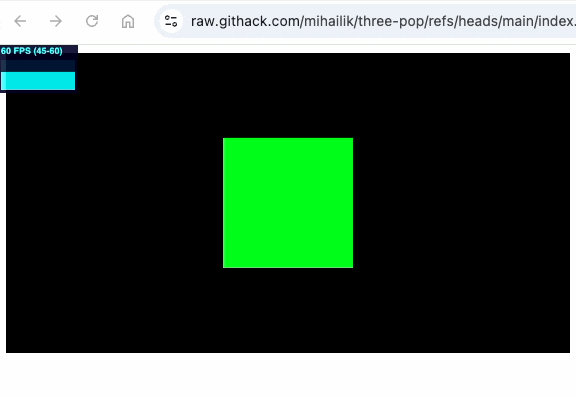

THREE-pop &mdash; popping a quick THREE.js demo with least effort
=======================================

This will give you a quick rotating cube setup:

```JavaScript

import * as THREE from 'three';
import { createScene } from 'three-pop';

const { scene, container } = createScene();

scene.add(new THREE.Mesh(
  new THREE.BoxGeometry(1, 1, 1),
  new THREE.MeshBasicMaterial({ color: 0x00ff00 })
));

document.body.appendChild(container);

```

[Live demo: **https://raw.githack.com/mihailik/three-pop/refs/heads/main/index.html**](https://raw.githack.com/mihailik/three-pop/refs/heads/main/index.html)

<a href="https://raw.githack.com/mihailik/three-pop/refs/heads/main/index.html">



</a>
